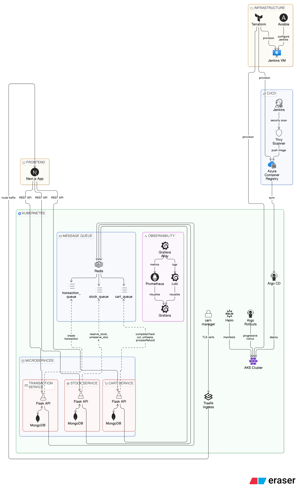

# DevOps Showcase

## Architecture Overview

## Microservices

**Technologies:** Python, Flask, MongoEngine, Celery, Redis.

**Technologies used in Jenkins pipeline:** Docker, Trivy, Azure Container Registry

| Name | Repository | What it is for |
|---|---|---|
| Cart Service | [devops_showcase_cart_service](https://github.com/genocem/devops_showcase_cart_service.git) | Manages carts, cart items, and checkout state. |
| Stock Service | [devops_showcase_stock_service](https://github.com/genocem/devops_showcase_stock_service.git) | Manages products and inventory operations. |
| Transaction Service | [devops_showcase_transaction_service](https://github.com/genocem/devops_showcase_transaction_service.git) | Manages transaction creation and transaction status updates. |

These microservices communicate with each other using Celery tasks over Redis queues.

## Frontend

| Name | Repository | What it is for | Technologies |
|---|---|---|---|
| Frontend | [devops_showcase_frontend](https://github.com/genocem/devops_showcase_frontend.git) | User-facing web application that drives the full flow across services. | TypeScript, React, Next.js,Jenkins (pipeline contains: Docker, Trivy, Azure Container Registry)  |

## GitOps 

| Name | Repository | What it is for | Technologies |
|---|---|---|---|
| GitOps | [devops_showcase_gitops](https://github.com/genocem/devops_showcase_gitops.git) | Contains Kubernetes bootstrap and deployment manifests/charts. | Kubernetes, Helm, Argo CD, Argo Rollouts, Traefik, cert-manager, Prometheus, Grafana, Loki, Grafana Alloy |

## Provisioning

| Name | Repository | What it is for | Technologies |
|---|---|---|---|
| Azure Provisioning | [devops_showcase_azure_provisioning](https://github.com/genocem/devops_showcase_azure_provisioning.git) | Contains Terraform and Ansible automation for infrastructure provisioning and Jenkins setup. | Azure, Terraform, Ansible, Ansible Vault, Jenkins, Docker, Azure Kubernetes Service (AKS), Azure Container Registry (ACR), Azure Virtual Machines |
